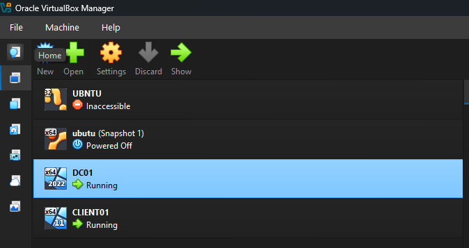
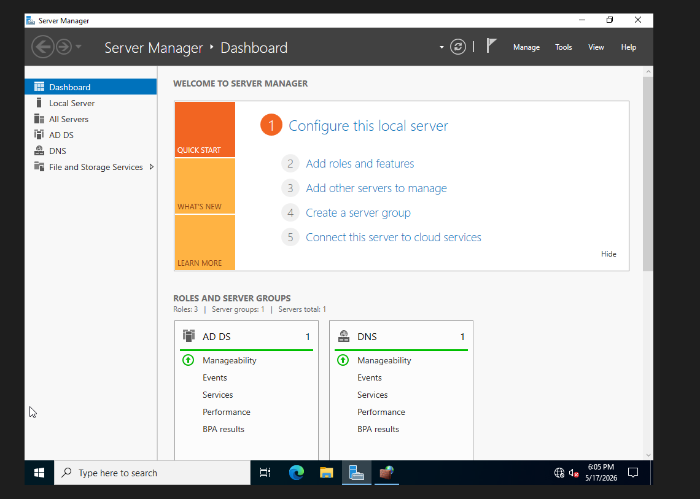
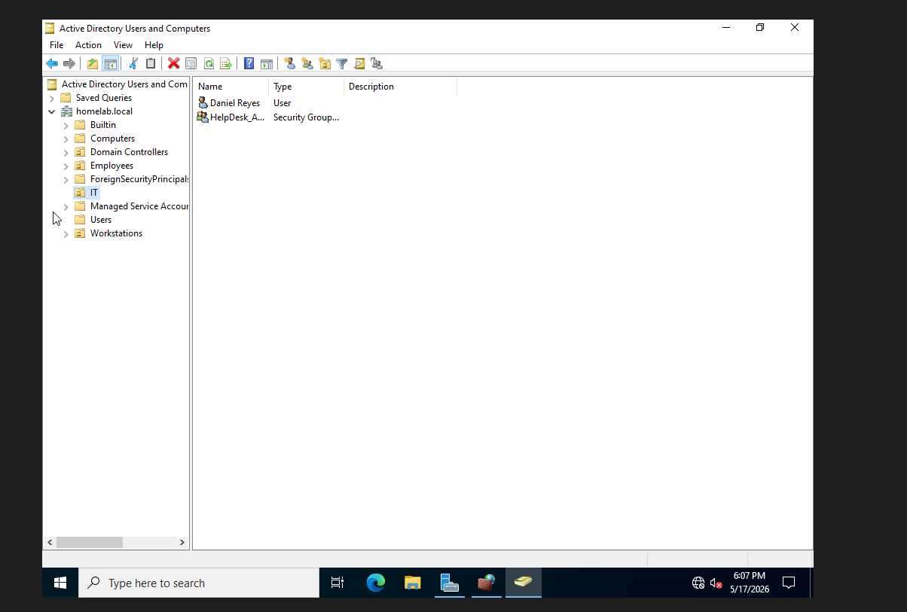
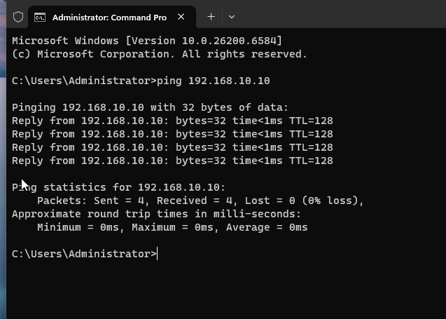
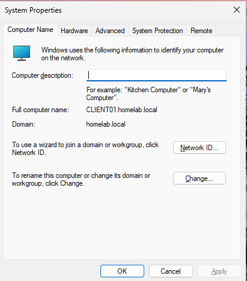
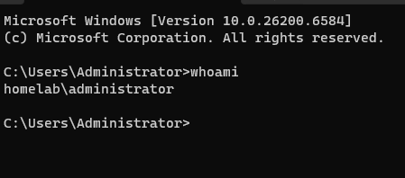
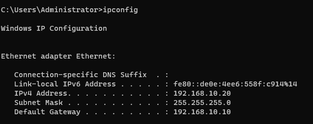

# Virtual Help Desk Home Lab

## Overview
This project documents my self-built virtual IT help desk lab used to practice Tier 1 support, Active Directory administration, Windows troubleshooting, networking, and documentation.

## Objectives
- Build a Windows domain environment
- Practice Active Directory administration
- Simulate help desk tickets
- Troubleshoot Windows issues
- Practice documentation and escalation notes
- Develop hands-on IT support experience

## Technologies Used
- Oracle VirtualBox / VMware
- Windows Server 2022
- Windows 10/11
- Active Directory
- DNS
- DHCP
- Group Policy
- PowerShell

## Planned Lab Systems
| System | Purpose |
|---|---|
| DC01 | Domain Controller |
| CLIENT01 | Help Desk Workstation |
| CLIENT02 | End User Workstation |
| TICKET01 | Ticketing System |

## Skills Practiced
- Password resets
- Account unlocks
- Group Policy
- Network troubleshooting
- Remote desktop support
- Shared folder permissions
- DNS troubleshooting
- DHCP troubleshooting
- Windows administration

## Ticket Documentation
Future tickets and troubleshooting exercises will be documented here.

## Screenshots
Screenshots will be added throughout the project.

## Lessons Learned
This section will be updated as the lab expands.

---

# Active Directory Home Lab Build

## Lab Objective

The objective of this lab was to build a functional enterprise-style Active Directory environment using Windows Server 2022 and Windows 11 within Oracle VirtualBox.

The lab simulates a small corporate environment where a domain controller manages authentication, users, groups, DNS, and domain-joined client systems.

This project was built to strengthen hands-on skills related to:
- Active Directory administration
- Windows Server management
- DNS configuration
- Client domain joins
- Network troubleshooting
- Virtualization
- Help desk support workflows

---

# Lab Environment

| System | Role | IP Address |
|---|---|---|
| DC01 | Domain Controller | 192.168.10.10 |
| CLIENT01 | Domain Client Workstation | 192.168.10.20 |

---

# Network Configuration

| Setting | Value |
|---|---|
| Network Range | 192.168.10.0/24 |
| VirtualBox Adapter | Host-Only Adapter |
| DHCP | Disabled |
| DNS Server | 192.168.10.10 |

---

# Step 1 – Virtual Lab Environment

A virtual lab environment was created using Oracle VirtualBox. Two virtual machines were deployed:
- DC01 (Windows Server 2022)
- CLIENT01 (Windows 11 Enterprise)

Both systems were connected using a Host-Only Adapter network to simulate an isolated enterprise environment.



---

# Step 2 – Windows Server 2022 Domain Controller Setup

Windows Server 2022 was installed and configured as the domain controller for the lab environment.

Installed roles included:
- Active Directory Domain Services (AD DS)
- DNS Server

The domain created for the environment was:

```powershell
homelab.local
```



---

# Step 3 – Active Directory Configuration

Active Directory Users and Computers was configured with Organizational Units (OUs), users, and security groups to simulate a real business environment.

Organizational Units created:
- IT
- Employees
- Workstations

Example accounts and groups:
- Daniel Reyes
- HelpDesk_Admins



---

# Step 4 – Network Connectivity Testing

Connectivity between CLIENT01 and the domain controller was verified using ICMP ping tests.

This confirmed:
- network communication
- DNS functionality
- VM connectivity



---

# Step 5 – Domain Join Configuration

CLIENT01 was successfully joined to the:

```powershell
homelab.local
```

domain.

This allowed centralized authentication through Active Directory.



---

# Step 6 – Domain Authentication Testing

Domain login authentication was tested successfully using a domain user account.

This confirmed:
- Active Directory authentication
- DNS resolution
- domain communication
- successful client integration



---

# Step 7 – Client Network Configuration

CLIENT01 was configured with:
- static IP addressing
- subnet mask
- DNS configuration
- gateway configuration

Troubleshooting included resolving:
- APIPA addressing
- connectivity failures
- firewall communication issues



---

# Skills Demonstrated

## Windows Server Administration
- Active Directory installation
- Domain controller promotion
- DNS configuration
- Server management

## Networking
- Static IP configuration
- DNS troubleshooting
- Ping testing
- Network troubleshooting
- Firewall troubleshooting

## Active Directory
- OU management
- User management
- Group management
- Domain joins
- Domain authentication

## Virtualization
- Oracle VirtualBox
- Virtual networking
- Host-only adapters
- Multi-VM environments

## Help Desk / IT Support
- Troubleshooting methodology
- Connectivity troubleshooting
- Client workstation configuration
- Domain support workflows
