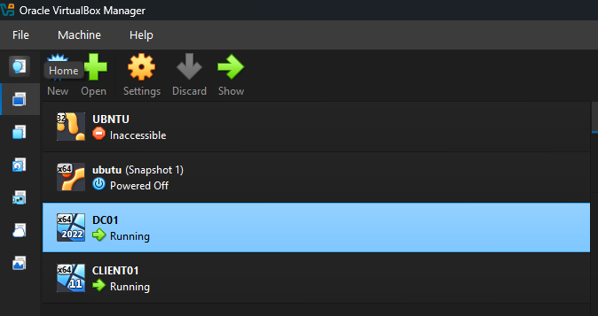
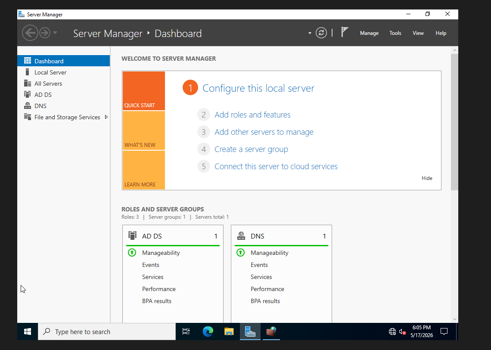
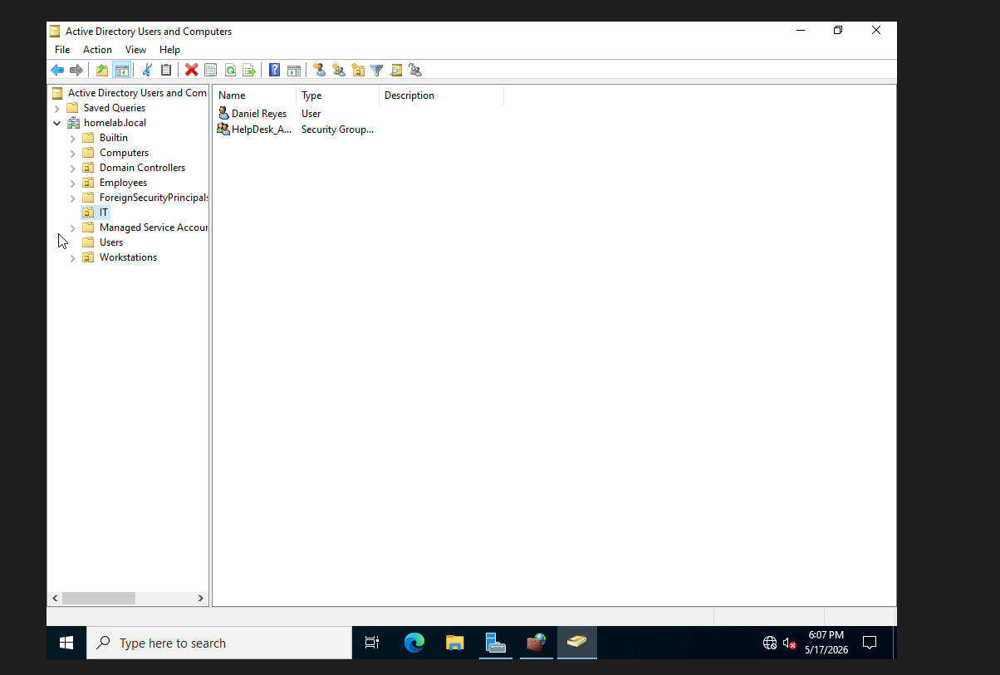
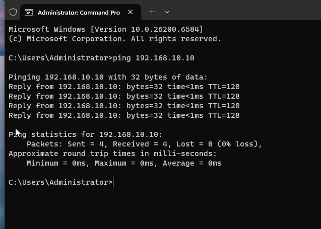
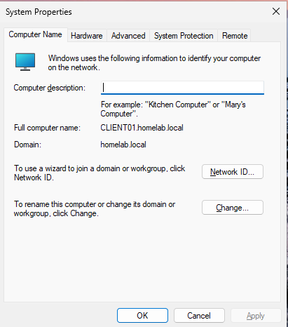
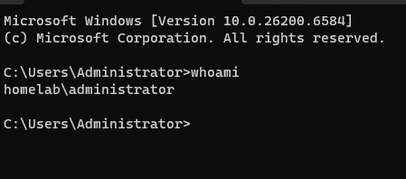
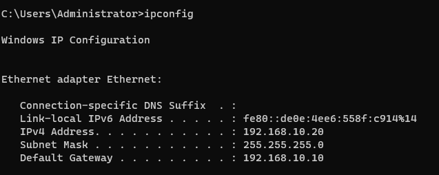
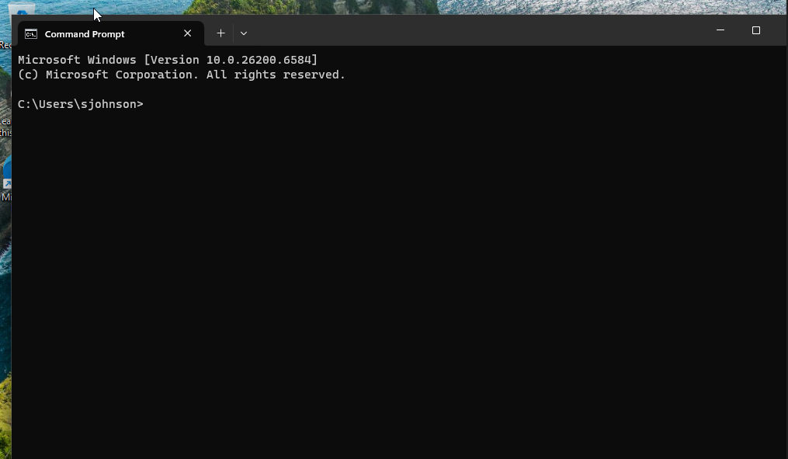
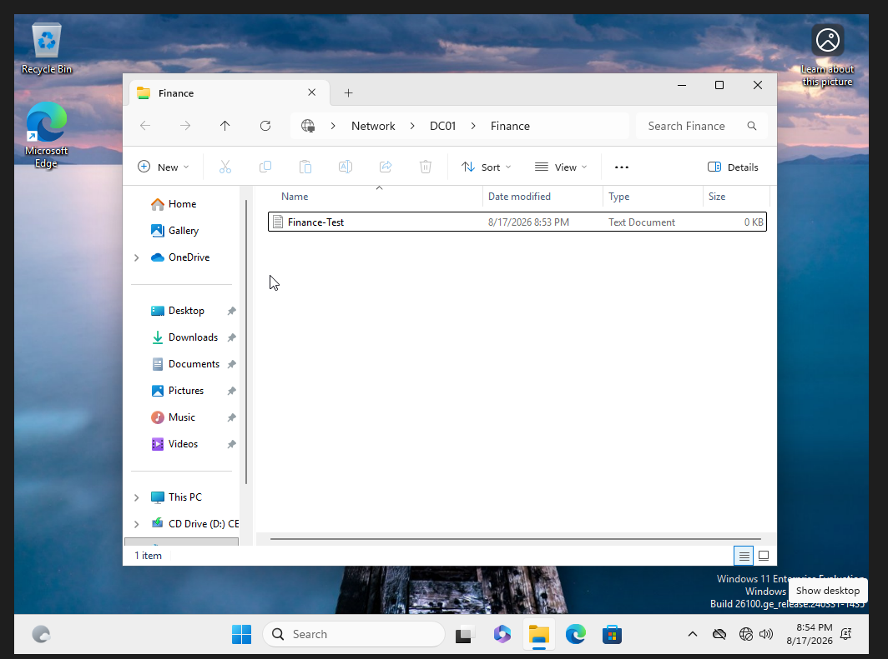

# Virtual Help Desk Home Lab

## Overview

This project documents the creation of a virtual enterprise IT help desk environment using Windows Server 2022 and Windows 11.

The lab simulates a real business environment where Active Directory manages users, computers, authentication, DNS, Group Policy, file sharing, and common IT support tasks.

The project is divided into three enterprise-style labs that build upon one another.

- **Lab 1:** Active Directory Infrastructure
- **Lab 2:** Enterprise Help Desk Operations
- **Lab 3:** Windows & Network Troubleshooting

---

# Objectives

- Build an enterprise Windows domain
- Configure Active Directory Domain Services
- Practice Windows Server administration
- Simulate real-world IT support scenarios
- Troubleshoot Windows and networking issues
- Develop hands-on IT support experience
- Document troubleshooting procedures and solutions

---

# Technologies Used

- Oracle VirtualBox
- Windows Server 2022
- Windows 11
- Active Directory Domain Services (AD DS)
- DNS
- DHCP
- Group Policy
- PowerShell

---

# Lab Environment

| System | Role | IP Address |
|---|---|---|
| DC01 | Domain Controller | 192.168.10.10 |
| CLIENT01 | Domain Workstation | 192.168.10.20 |

---

# Network Configuration

| Setting | Value |
|---|---|
| Network Range | 192.168.10.0/24 |
| VirtualBox Adapter | Host-Only Adapter |
| DHCP | Disabled |
| DNS Server | 192.168.10.10 |

---

# ==========================================
# LAB 1 – ACTIVE DIRECTORY INFRASTRUCTURE
# ==========================================

## Objective

Build a functional enterprise Active Directory environment that will be used throughout the remaining labs.

---

## Step 1 – Virtual Lab Environment

A virtual lab environment was created using Oracle VirtualBox.

Virtual machines deployed:

- DC01 (Windows Server 2022)
- CLIENT01 (Windows 11)

Both systems were connected using a Host-Only Adapter network to simulate an isolated enterprise environment.



---

## Step 2 – Windows Server 2022 Domain Controller Setup

Windows Server 2022 was installed and promoted as the Domain Controller.

Installed Roles:

- Active Directory Domain Services (AD DS)
- DNS Server

Domain Created:

```powershell
homelab.local
```



---

## Step 3 – Active Directory Configuration

Configured Active Directory Users and Computers.

Created:

- Organizational Units (OUs)
- Users
- Security Groups

Example:

- IT
- Employees
- Workstations



---

## Step 4 – Network Connectivity Testing

Verified communication between CLIENT01 and DC01 using ICMP ping.

Confirmed:

- Network connectivity
- DNS functionality
- Virtual machine communication



---

## Step 5 – Domain Join Configuration

CLIENT01 successfully joined:

```powershell
homelab.local
```

Verified centralized authentication through Active Directory.



---

## Step 6 – Domain Authentication Testing

Verified successful domain authentication.

Confirmed:

- Active Directory authentication
- DNS resolution
- Domain communication



---

## Step 7 – Client Network Configuration

Configured:

- Static IP Address
- DNS Server
- Subnet Mask

Troubleshooting included:

- APIPA addressing
- Connectivity failures
- Firewall communication



---

# ==========================================
# LAB 2 – ENTERPRISE HELP DESK OPERATIONS
# ==========================================

## Objective

Use the Active Directory environment created in Lab 1 to simulate the daily responsibilities of a Tier 1 IT Support Technician.

---

## Company Environment

**Company Name**

Northwind Manufacturing

### Departments

- Human Resources
- Finance
- Sales
- Information Technology
- Operations

### Domain

```powershell
homelab.local
```

### Users

| User | Department |
|---|---|
| Sarah Johnson | Human Resources |
| Michael Carter | Finance |
| Emily Davis | Sales |
| Alex Martinez | Information Technology |
| James Wilson | Operations |

### Security Groups

- HelpDesk_Technicians

---

## Help Desk Scenarios

### HD-001 – Password Reset ✅

Completed Tasks

- Reset user password
- Required password change at next logon
- Verified successful domain authentication



---

### HD-002 – Finance Shared Folder Access ✅

### Tasks Completed

- Created the Finance shared folder
- Configured network share permissions
- Configured NTFS permissions for the Finance user
- Tested access from CLIENT01 as Michael Carter
- Identified an Access Denied issue caused by Read-only share permissions
- Updated share permissions to allow Change and Read
- Verified Michael could create, edit, save, and reopen files



---

### Upcoming Scenarios

- HD-003 – New Employee Onboarding
- HD-004 – Account Lockout
- HD-005 – Group Membership Management
- HD-006 – Shared Folder Permissions
- HD-007 – Group Policy Administration
- HD-008 – Windows Administration

---

# ==========================================
# LAB 3 – WINDOWS & NETWORK TROUBLESHOOTING
# ==========================================

## Objective

Practice diagnosing and resolving common Windows and network issues in an enterprise environment.

### Planned Scenarios

- DNS Troubleshooting
- DHCP Troubleshooting
- Printer Troublesbleshooting
- Event Viewer Analysis
- Windows Services
- Remote Desktop (RDP)
- PowerShell Diagnostics
- Network Connectivity Troubleshooting

---

# Skills Demonstrated

## Windows Server

- Active Directory Administration
- Domain Controller Management
- DNS Configuration
- Group Policy Administration

## Active Directory

- Organizational Unit (OU) Management
- User Management
- Security Group Management
- Password Resets
- Domain Authentication

## Networking

- Static IP Configuration
- DNS Troubleshooting
- Network Connectivity Testing
- Windows Networking

## Help Desk

- Password Resets
- User Administration
- Shared Folder Management
- Windows Troubleshooting
- Documentation

---

# Lessons Learned

This project will continue to expand as additional enterprise IT support scenarios and troubleshooting exercises are completed.
